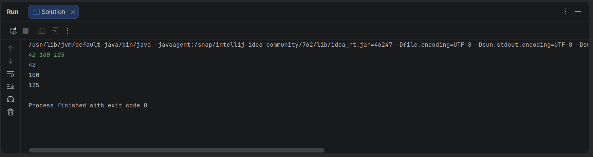

# Entrada-e-Saida-Padrao-I

## Lendo da Entrada Padrão (stdin)

A maioria dos desafios do HackerRank exige que você leia a entrada a partir de `stdin` (entrada padrão) e escreva a saída em `stdout` (saída padrão).

Uma maneira popular de ler a entrada de `stdin` é usando a classe `Scanner` e especificando o fluxo de entrada como `System.in`. Por exemplo:

```java
Scanner scanner = new Scanner(System.in);
String myString = scanner.next();
int myInt = scanner.nextInt();
scanner.close();

System.out.println("myString is: " + myString);
System.out.println("myInt is: " + myInt);

```

O código acima cria um objeto `Scanner` e o utiliza para ler uma `String` e um `int`. Em seguida, ele fecha o objeto `Scanner` porque não há mais entrada a ser lida, e imprime no `stdout` usando `System.out.println(String).` Portanto, se a nossa entrada for:

```text
Hi 5

```

O nosso código irá imprimir:

```text
myString is: Hi
myInt is: 5

```

Alternativamente, você pode usar a classe `BufferedReader`.

## Tarefa

Neste desafio, você deve ler $3$ inteiros de `stdin` e, em seguida, imprimi-los em `stdout`. Cada inteiro deve ser impresso em uma nova linha. Para tornar o problema um pouco mais fácil, uma parte do código já é fornecida para você no editor abaixo.

## Formato de Entrada

Existem $3$ linhas de entrada, e cada linha contém um único inteiro.

## Exemplo de Entrada

```text
42
100
125

```

## Exemplo de Saída

```text
42
100
125

```

---

## Template Inicial do Desafio

```java
import java.util.*;

public class Solution {

    public static void main(String[] args) {
        Scanner scan = new Scanner(System.in);
        int a = scan.nextInt();
        // Complete this line
        // Complete this line

        System.out.println(a);
        // Complete this line
        // Complete this line
    }
}
```

## Solução

```java
import java.util.*;

public class Solution {

    public static void main(String[] args) {
        Scanner scan = new Scanner(System.in);
        int a = scan.nextInt();
        int b = scan.nextInt();
        int c = scan.nextInt();
        scan.close();

        System.out.println(a);
        System.out.println(b);
        System.out.println(c);
    }
}
```

### Saída no Console

<p align="center">
  
</p>

---

### O Conceito de "Delimitador" no Scanner

Por padrão, a classe `Scanner` utiliza uma expressão regular que representa **qualquer espaço em branco** como separador (*delimitador*) para dividir a entrada em partes (chamadas de *tokens*).

Na linguagem Java, "espaço em branco" (whitespace) engloba vários caracteres, incluindo:

* O espaço simples (` `)
* A quebra de linha (`\n` ou `\r\n`, gerada pelo `<Enter>`)
* O tabulador (`\t`)

Portanto, para o método `nextInt()`, não importa se o próximo número está do lado ou na linha de baixo; ele simplesmente ignora todos os espaços em branco anteriores, lê o número e para assim que encontra o próximo espaço em branco.

---

#### Os dois cenários de execução

##### Cenário 1: Separados por Espaço

Se você digitar na console:
`42 100 125[Enter]`

O `Scanner` enxerga um único fluxo de texto.

1. O primeiro `nextInt()` consome `42` e para no espaço.
2. O segundo `nextInt()` pula o espaço, consome `100` e para no próximo espaço.
3. O terceiro `nextInt()` pula o espaço, consome `125` e para na quebra de linha.

##### Cenário 2: Separados por Enter

Se você digitar na console:
`42[Enter]`
`100[Enter]`
`125[Enter]`

O comportamento do código é idêntico:

1. O primeiro `nextInt()` consome `42` e para na quebra de linha.
2. O segundo `nextInt()` ignora a quebra de linha, consome `100` e para na próxima quebra.
3. O terceiro faz o mesmo com o `125`.

---

#### De onde vem essa confusão comum?

Essa percepção de que "deve ser na mesma linha" geralmente acontece por dois motivos:

1. **Uso misto com `nextLine()`:** Se o seu código tivesse um `scan.nextLine()` logo após um `nextInt()`, o comportamento quebraria ao usar o `<Enter>`. Isso ocorre porque o `nextInt()` consome o número mas **deixa a quebra de linha (`\n`) para trás no buffer**. O `nextLine()` subsequente capturaria essa quebra de linha vazia imediatamente, parecendo que o programa "pulou" uma leitura. Como o seu código só usa `nextInt()`, esse problema não acontece.
2. **Plataformas de Desafios (como HackerRank ou Beecrowd):** Muitas vezes os exemplos de entrada de dados (*Input Format*) desses sites são ilustrados em uma única linha de texto para economizar espaço na tela, induzindo o desenvolvedor a achar que o código só funciona daquela forma estrita.

Em resumo: o código está robusto e pronto para tratar os números de ambas as formas.

---

