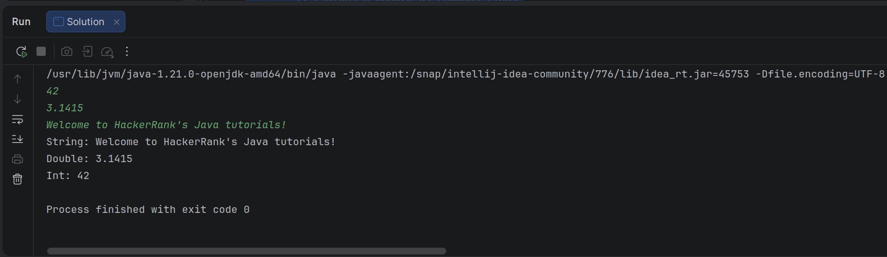

# # Entrada e Saída Padrão II

Neste desafio, você deve ler um número inteiro (`integer`), um número de ponto flutuante (`double`) e uma `String` a partir do `stdin`, e então imprimir os valores de acordo com as instruções na seção **Formato de Saída** abaixo. Para tornar o problema um pouco mais fácil, uma parte do código já é fornecida para você no editor.

*Nota: Recomendamos concluir o desafio "Entrada e Saída Padrão em Java I" antes de tentar este.*

## Formato de Entrada

Existem três linhas de entrada:

1. A primeira linha contém um inteiro (`integer`).
2. A segunda linha contém um `double`.
3. A terceira linha contém uma `String`.

## Formato de Saída

Existem três linhas de saída:

1. Na primeira linha, imprima `String:` seguido pela `String` inalterada que foi lida do `stdin`.
2. Na segunda linha, imprima `Double:` seguido pelo `double` inalterado que foi lido do `stdin`.
3. Na terceira linha, imprima `Int:` seguido pelo inteiro inalterado que foi lido do `stdin`.

*Nota: Se você usar o método `nextLine()` imediatamente após o método `nextInt()`, lembre-se de que o `nextInt()` lê apenas tokens numéricos; por causa disso, o caractere de quebra de linha (`\n`) no final daquela linha de entrada inteira ainda permanece na fila do buffer de entrada, e o próximo `nextLine()` acabará lendo o restante dessa linha (que está vazia).*

## Exemplo de Entrada

```text
42
3.1415
Welcome to HackerRank's Java tutorials!
```

## Exemplo de Saída

```text
String: Welcome to HackerRank's Java tutorials!
Double: 3.1415
Int: 42
```

## Template Inicial do Desafio

```java
import java.util.Scanner;

public class Solution {

    public static void main(String[] args) {
        Scanner scan = new Scanner(System.in);
        int i = scan.nextInt();
        // Write your code here.

        System.out.println("String: " + s);
        System.out.println("Double: " + d);
        System.out.println("Int: " + i);
    }
}
```

## Solução

```java
import java.util.Scanner;
import java.util.Locale;

public class Solution {

    public static void main(String[] args) {
        // Instancia o Scanner associado à entrada padrão (teclado/stdin)
        // .useLocale(Locale.US) força o interpretador a aceitar o ponto (.) como separador decimal
        Scanner scan = new Scanner(System.in).useLocale(Locale.US);

        // Lê o próximo token que possa ser interpretado como um número inteiro
        int i = scan.nextInt();
        
        // Lê o próximo token que possa ser interpretado como um número de ponto flutuante (double)
        double d = scan.nextDouble();

        // Consome o caractere de quebra de linha ('\n') residual que o método nextDouble() 
        // deixou pendente no buffer de entrada. Sem isso, o próximo nextLine() capturaria o vazio.
        scan.nextLine();

        // Lê toda a sequência de caracteres restante na linha atual até encontrar a próxima quebra de linha
        String s = scan.nextLine();

        // Fecha o fluxo de entrada (Scanner), liberando os recursos do sistema operacional associados a ele
        scan.close(); 

        // Exibe os resultados formatados na saída padrão (stdout) conforme a especificação do desafio
        System.out.println("String: " + s);
        System.out.println("Double: " + d);
        System.out.println("Int: " + i);
    }
}
```


### Explicação Arquitetural: O que aconteceu aqui?

Para entender o porquê de cada linha, precisamos olhar para como o Java gerencia a entrada de dados através do fluxo conhecido como `stdin` utilizando a classe `Scanner`.

#### 1. A Internacionalização (`Locale.US`)

Por padrão, a JVM (Java Virtual Machine) herda as configurações regionais do sistema operacional hospedeiro. Em sistemas configurados em Português do Brasil (pt-BR), o Java espera que você digite `3,1415` (com vírgula). Plataformas de código internacionais enviam os dados de teste no formato americano (`3.1415`). O uso do `.useLocale(Locale.US)` resolve esse descasamento de forma definitiva, instruindo o `Scanner` a analisar strings numéricas usando convenções anglo-saxãs.

#### 2. A Dinâmica dos Tokens vs. Linhas Inteiras

Os métodos `nextInt()` e `nextDouble()` são leitores de **tokens** (valores individuais separados por espaços em branco ou quebras de linha).

* Quando a entrada envia `42\n`, o `nextInt()` varre o fluxo, captura o valor numérico `42` e para imediatamente **antes** do caractere de nova linha (`\n`).
* O mesmo ocorre com o `nextDouble()`. Ele consome o `3.1415` e deixa o `\n` daquela linha esquecido dentro do buffer de memória do `Scanner`.

#### 3. O Problema e a Solução do Buffer

O método `nextLine()` opera com uma lógica diferente: ele lê tudo o que estiver no buffer até encontrar um caractere `\n`, consome esse caractere e retorna o texto encontrado.

Se não houvesse a linha de limpeza (`scan.nextLine();`), o comando que deveria ler a frase `"Welcome to HackerRank's..."` olharia para o buffer, encontraria aquele `\n` residual deixado pelo `nextDouble()` e pensaria: *"Pronto, achei o fim de uma linha!"*. Ele retornaria uma string vazia `""` e encerraria a leitura, deixando a frase real flutuando no buffer sem ser lida.

Ao inserir um `scan.nextLine()` intermediário e "descartável", você deliberadamente engoliu aquele lixo do buffer, deixando o caminho livre para a leitura correta da terceira linha.


## Console

<p align="center">
  
</p>