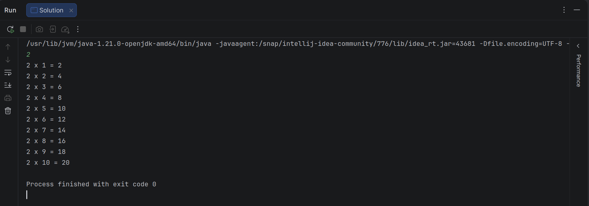

# Loops em Java I

## Objetivo

Neste desafio, vamos usar laços de repetição (*loops*) para nos ajudar a realizar algumas operações matemáticas simples.

## Tarefa

Dado um número inteiro $N$, imprima os seus primeiros 10 múltiplos. Cada múltiplo $i$ (onde $1 \le i \le 10$) deve ser impresso em uma nova linha no formato: `N x i = resultado`.

## Formato de Entrada

Um único número inteiro, $N$.

## Restrições

* $2 \le N \le 20$

## Formato de Saída

Imprima 10 linhas de saída; cada linha $i$ (onde $1 \le i \le 10$) deve conter o resultado de $N \times i$ no formato:
`N x i = resultado`.

## Exemplo de Entrada

```text
2

```

## Exemplo de Saída

```text
2 x 1 = 2
2 x 2 = 4
2 x 3 = 6
2 x 4 = 8
2 x 5 = 10
2 x 6 = 12
2 x 7 = 14
2 x 8 = 16
2 x 9 = 18
2 x 10 = 20

```

## Template Inicial do Desafio

```java
import java.io.*;
import java.math.*;
import java.security.*;
import java.text.*;
import java.util.*;
import java.util.concurrent.*;
import java.util.regex.*;


public class Solution {
    public static void main(String[] args) throws IOException {
        BufferedReader bufferedReader = new BufferedReader(new InputStreamReader(System.in));

        int N = Integer.parseInt(bufferedReader.readLine().trim());

        bufferedReader.close();
    }
}
```

## Solução

```java
import java.io.*;

public class Solution {
    public static void main(String[] args) throws IOException {
        // BufferedReader é utilizado para ler a entrada do console de forma eficiente
        BufferedReader bufferedReader = new BufferedReader(new InputStreamReader(System.in));

        // Lê a linha de entrada, remove espaços em branco extras e converte o texto para um número inteiro
        int N = Integer.parseInt(bufferedReader.readLine().trim());

        // Laço de repetição (for) que inicia em 1 e vai até 10 (inclusive)
        // A cada iteração, a variável 'i' é incrementada em 1 (i++)
        for (int i = 1; i <= 10; i++) {
            // Calcula o produto de N por i
            int resultado = N * i;
            
            // Exibe o resultado no console (stdout) seguindo o formato exato exigido pelo desafio: "N x i = resultado"
            System.out.println(N + " x " + i + " = " + resultado);
        }

        // Fecha o leitor de fluxo de entrada para liberar os recursos do sistema
        bufferedReader.close();
    }
}

```

### Detalhamento

O objetivo deste desafio é gerar a tabuada de um número inteiro $N$ fornecido pela plataforma, limitando-se aos multiplicadores de 1 a 10.

### 1. Leitura da Entrada

Para capturar o valor de $N$, o código utiliza as classes `BufferedReader` e `InputStreamReader`. Essa combinação é o padrão gerado automaticamente pelo HackerRank por ser mais performática do que a classe `Scanner` em cenários com grande volume de dados.

* O método `bufferedReader.readLine()` captura a linha digitada como uma *String*.
* O método `.trim()` remove eventuais espaços em branco invisíveis no início ou no fim da linha.
* O método `Integer.parseInt()` transforma essa *String* em um número inteiro primitivo (`int`), permitindo que realizemos cálculos matemáticos com ele.

### 2. O Laço de Repetição (`for`)

Como sabemos exatamente quantas vezes precisamos repetir a operação (10 vezes, do 1 ao 10), o laço `for` é a estrutura de controle ideal.

```java
for (int i = 1; i <= 10; i++)

```

* **Inicialização (`int i = 1`):** Criamos uma variável de controle chamada `i` e começamos ela em 1, que é o primeiro multiplicador da tabuada.
* **Condição de Continuidade (`i <= 10`):** O laço continuará executando o bloco de código interno enquanto o valor de `i` for menor ou igual a 10. No momento em que `i` se tornar 11, o laço é interrompido.
* **Incremento (`i++`):** Ao final de cada repetição, somamos 1 ao valor atual de `i`.

### 3. Interpolação e Saída de Dados

Dentro do laço, calculamos o `resultado` multiplicando `N` por `i`.

A linha mais importante para a validação do desafio é o `System.out.println`. O avaliador automático compara caractere por caractere da sua saída com o gabarito. Por isso, usamos o operador de concatenação `+` para juntar variáveis e textos fixos, garantindo os espaços exatos antes e depois do caractere `" x "` e do sinal de `"="`.

## Console

<p align="center">
  
</p>