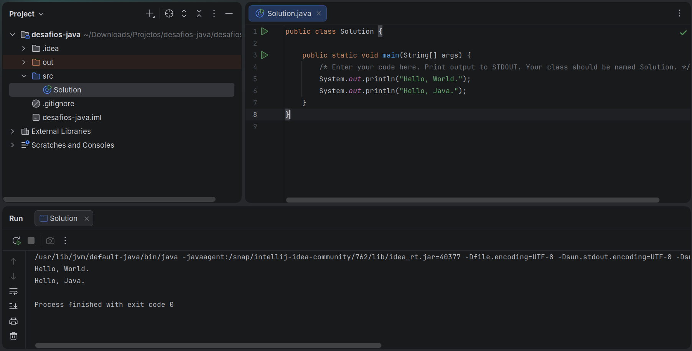

# Formatação de Saída em Java

Bem-vindo ao mundo do Java! Neste desafio, praticamos a impressão no `stdout`.

Os stubs de código em seu editor declaram uma classe `Solution` e um método `main`. Complete o método `main` copiando as duas linhas de código abaixo e colando-as dentro do corpo do seu método `main`.

```java
System.out.println("Hello, World.");
System.out.println("Hello, Java.");

```

## Formato de Entrada

Não existe entrada para este desafio.

## Formato de Saída

A saída deverá exibir as duas linhas abaixo:

1. `Hello, World.` na primeira linha.
2. `Hello, Java.` na segunda linha.

## Exemplo de Saída

```text
Hello, World.
Hello, Java.

```

---

## Template Inicial do Desafio

```java
public class Solution {

    public static void main(String[] args) {
        /* Enter your code here. Print output to STDOUT. Your class should be named Solution. */
    }
}
```

--- 

## ✅ Solução

```java
public class Solution {

    public static void main(String[] args) {
        /* Enter your code here. Print output to STDOUT. Your class should be named Solution. */
        System.out.println("Hello, World.");
        System.out.println("Hello, Java.");
    }
}
```

### Captura de tela

<p align="center">
  
</p>